# 🚲 Old Bicycle Marketplace - Main Application Flows

## Table of Contents
1. [System Architecture](#system-architecture)
2. [User Authentication Flow](#user-authentication-flow)
3. [Buyer Journey](#buyer-journey)
4. [Seller Journey](#seller-journey)
5. [Payment & Transaction Flow](#payment--transaction-flow)
6. [Real-time Chat System](#real-time-chat-system)
7. [Dispute Resolution Flow](#dispute-resolution-flow)
8. [Admin Dashboard Flow](#admin-dashboard-flow)
9. [Inspection & Review Flow](#inspection--review-flow)

---

## System Architecture

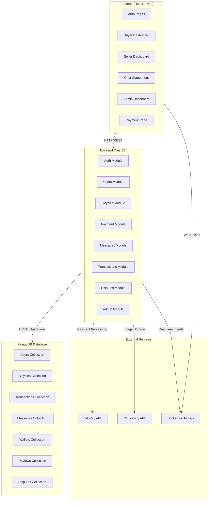

---

## User Authentication Flow

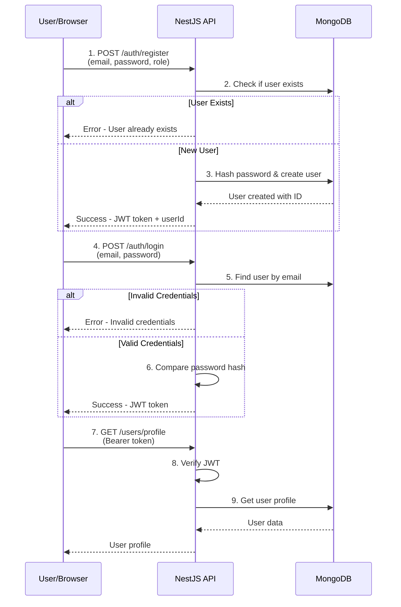

---

## Buyer Journey

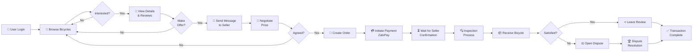

---

## Seller Journey

```mermaid
graph LR
    A["🔐 User Login"] --> B["📋 Create Listing"]
    B --> C["📝 Fill Bicycle Info<br/>Tab 1: Basic Info"]
    C --> D["📷 Upload Photos<br/>Tab 2: Images"]
    D --> E["💰 Set Price<br/>Tab 3: Price & Delivery"]
    E --> F["📊 Condition & Details<br/>Tab 4: Condition"]
    F --> G["📤 Publish Listing"]
    G --> H["💬 Wait for Offers"]
    H --> I{Offer<br/>Received?}
    I -->|Yes| J["💬 Chat with Buyer"]
    J --> K{"Price<br/>Agreed?"}
    K -->|No| J
    K -->|Yes| L["✅ Accept Order"]
    L --> M["⏳ Buyer Pays<br/>Escrow"]
    M --> N["🔍 Inspection<br/>Scheduled"]
    N --> O["📋 Inspector<br/>Approves"]
    O --> P["📦 Prepare & Ship"]
    P --> Q["💰 Receive Payment<br/>from Escrow"]
    Q --> R["⭐ Buyer Reviews"]
    R --> S["✅ Transaction<br/>Complete"]
```

---

## Payment & Transaction Flow

```mermaid
sequenceDiagram
    participant Buyer as Buyer
    participant API as NestJS API
    participant Escrow as Escrow Wallet
    participant ZaloPay as ZaloPay Gateway
    participant Seller as Seller
    
    Buyer->>API: 1. Confirm Purchase<br/>(bicycleId, amount)
    API->>API: 2. Create Transaction<br/>(status: PENDING)
    API->>ZaloPay: 3. Request Payment URL
    ZaloPay-->>API: Payment Link
    API-->>Buyer: 4. Redirect to ZaloPay
    Buyer->>ZaloPay: 5. Complete Payment
    ZaloPay-->>Buyer: Payment Confirmation
    ZaloPay->>API: 6. Webhook Callback<br/>(transaction_id, status)
    
    alt Payment Failed
        API->>API: Mark Transaction FAILED
        API-->>Buyer: Payment failed
    else Payment Success
        API->>Escrow: 7. Lock Amount in Escrow
        Escrow-->>API: Amount Locked
        API->>API: 8. Update Transaction<br/>(status: ESCROW_LOCKED)
        API-->>Buyer: 9. Payment successful
        API-->>Seller: 10. New order received
        
        Note over API,Escrow: 7-day inspection period
        
        API->>API: 11. Inspection approved
        API->>Escrow: 12. Release Payment
        Escrow->>Seller: 13. Amount transferred
        API->>API: 14. Update Transaction<br/>(status: COMPLETED)
    end
```

---

## Real-time Chat System

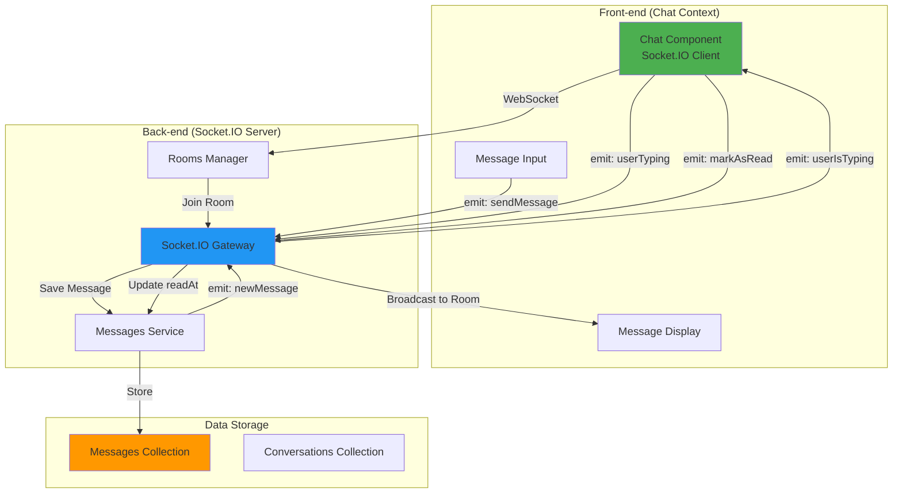

**Chat Features:**
- Real-time message delivery via WebSocket
- Typing indicators
- Read receipts
- User online status
- Conversation history
- Message persistence in MongoDB

---

## Dispute Resolution Flow

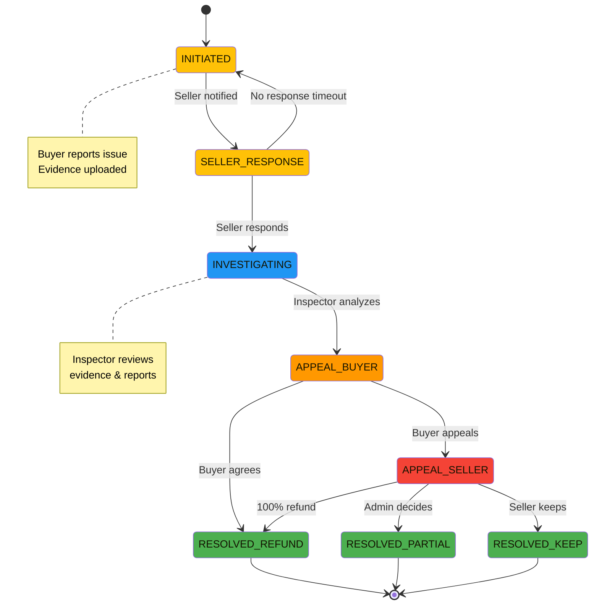

**Dispute Statuses:**
1. **INITIATED** - Buyer opens dispute with evidence
2. **SELLER_RESPONSE** - Seller provides response
3. **INVESTIGATING** - Inspector examines case
4. **APPEAL_BUYER** - Initial decision, buyer can appeal
5. **APPEAL_SELLER** - Escalation level
6. **RESOLVED_** - Final resolution (REFUND, PARTIAL, KEEP)

---

## Admin Dashboard Flow

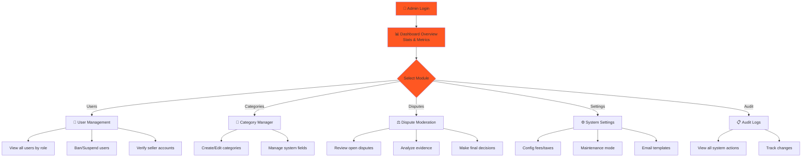

---

## Inspection & Review Flow

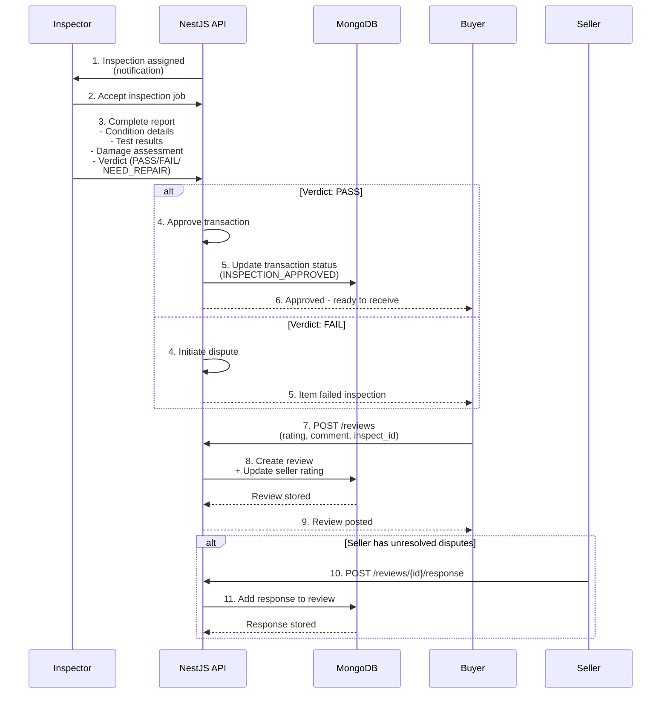

---

## User Role Permission Matrix

```mermaid
graph TD
    A["GUEST<br/>Users"] --> A1["✓ View bicycles"]
    A --> A2["✓ View reviews"]
    A --> A3["✗ Message"]
    A --> A4["✗ Purchase"]
    A --> A5["✗ List bicycles"]
    
    B["BUYER<br/>Users"] --> B1["✓ All guest actions"]
    B --> B2["✓ Make offers"]
    B --> B3["✓ Message sellers"]
    B --> B4["✓ Purchase bicycles"]
    B --> B5["✓ Open disputes"]
    B --> B6["✓ Leave reviews"]
    
    C["SELLER<br/>Users"] --> C1["✓ All buyer actions"]
    C --> C2["✓ Create listings"]
    C --> C3["✓ Edit own listings"]
    C --> C4["✓ Accept orders"]
    C --> C5["✓ Respond to disputes"]
    C --> C6["✓ Respond to reviews"]
    
    D["INSPECTOR<br/>Users"] --> D1["✓ View inspections"]
    D --> D2["✓ Complete reports"]
    D --> D3["✓ Verify products"]
    D --> D4["✓ Provide verdicts"]
    
    E["ADMIN<br/>Users"] --> E1["✓ Manage users"]
    E --> E2["✓ Manage categories"]
    E --> E3["✓ Moderate disputes"]
    E --> E4["✓ View audit logs"]
    E --> E5["✓ System config"]
    
    style A fill:#E3F2FD
    style B fill:#C8E6C9
    style C fill:#FFF9C4
    style D fill:#FFE0B2
    style E fill:#F8BBD0
```

---

## Wallet System Flow

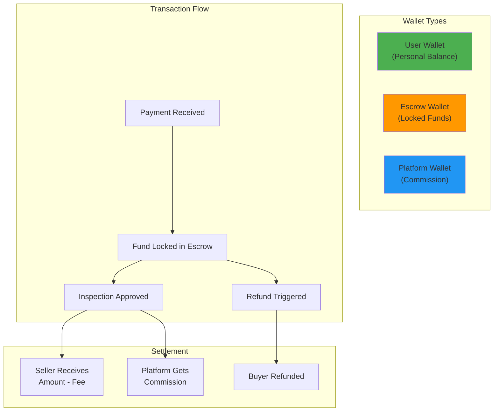

---

## Complete Transaction Lifecycle

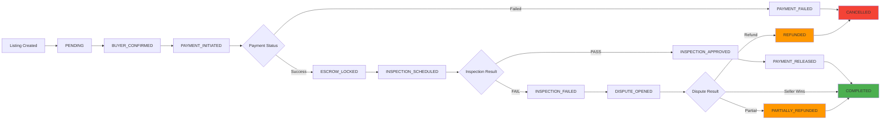

---

## Key Features Summary

| Feature | Technology | Status |
|---------|-----------|--------|
| Real-time Chat | Socket.IO | ✅ WebSocket-based |
| Payment Processing | ZaloPay API | ✅ Integrated |
| Image Management | Cloudinary | ✅ Cloud storage |
| Authentication | JWT | ✅ Role-based |
| Database | MongoDB + TypeORM | ✅ Document-based |
| Escrow System | Custom Wallet | ✅ 7-day protection |
| Dispute Resolution | Multi-stage | ✅ Inspector + Admin |
| Reviews & Ratings | 1-5 Star | ✅ Community-driven |
| Inspections | Report-based | ✅ Technical verdict |

---

## Quick Reference: API Endpoints

### Auth Endpoints
- `POST /auth/register` - User registration
- `POST /auth/login` - User login
- `POST /auth/logout` - User logout
- `POST /auth/refresh-token` - Token refresh

### Bicycle Endpoints
- `GET /bicycles` - List all bicycles (with filters)
- `POST /bicycles` - Create new listing
- `GET /bicycles/:id` - Get bicycle details
- `PUT /bicycles/:id` - Update listing
- `DELETE /bicycles/:id` - Delete listing

### Transaction Endpoints
- `POST /transactions` - Create transaction
- `GET /transactions` - List user transactions
- `GET /transactions/:id` - Get transaction details
- `PUT /transactions/:id/status` - Update status

### Messages Endpoints
- `GET /messages/conversations` - List conversations
- `POST /messages/send` - Send message
- `GET /messages/:conversationId` - Get chat history

### Disputes Endpoints
- `POST /disputes` - Open dispute
- `GET /disputes` - List disputes
- `PUT /disputes/:id/respond` - Seller response
- `PUT /disputes/:id/resolve` - Admin resolution

---

## Deployment Architecture

```
┌─────────────────────────────────────────┐
│         Client (Browser)                │
│  React 19 + Vite + Tailwind CSS         │
└────────────────┬────────────────────────┘
                 │ HTTP/WebSocket
                 ▼
┌─────────────────────────────────────────┐
│    NestJS Backend (REST + Socket.IO)    │
│  - Express for HTTP                     │
│  - Socket.IO for Real-time              │
│  - TypeORM + MongoDB                    │
└────────────────┬────────────────────────┘
                 │
        ┌────────┼────────┐
        ▼        ▼        ▼
    ┌───────┐ ┌────────┐ ┌──────────┐
    │MongoDB│ │ZaloPay │ │Cloudinary│
    │       │ │ API    │ │ API      │
    └───────┘ └────────┘ └──────────┘
```

---

## Summary

This bicycle marketplace is a **complete peer-to-peer platform** with:
- ✅ Multi-role user system (Guest → Buyer → Seller → Inspector → Admin)
- ✅ Secure payment processing with escrow protection
- ✅ Real-time communication between buyers and sellers
- ✅ Technical inspection and quality assurance
- ✅ Dispute resolution mechanism
- ✅ Community reviews and reputation system
- ✅ Admin dashboard for platform management

The architecture is **scalable, secure, and user-centric**, designed to build trust in the peer-to-peer marketplace through multiple verification layers and community feedback.
