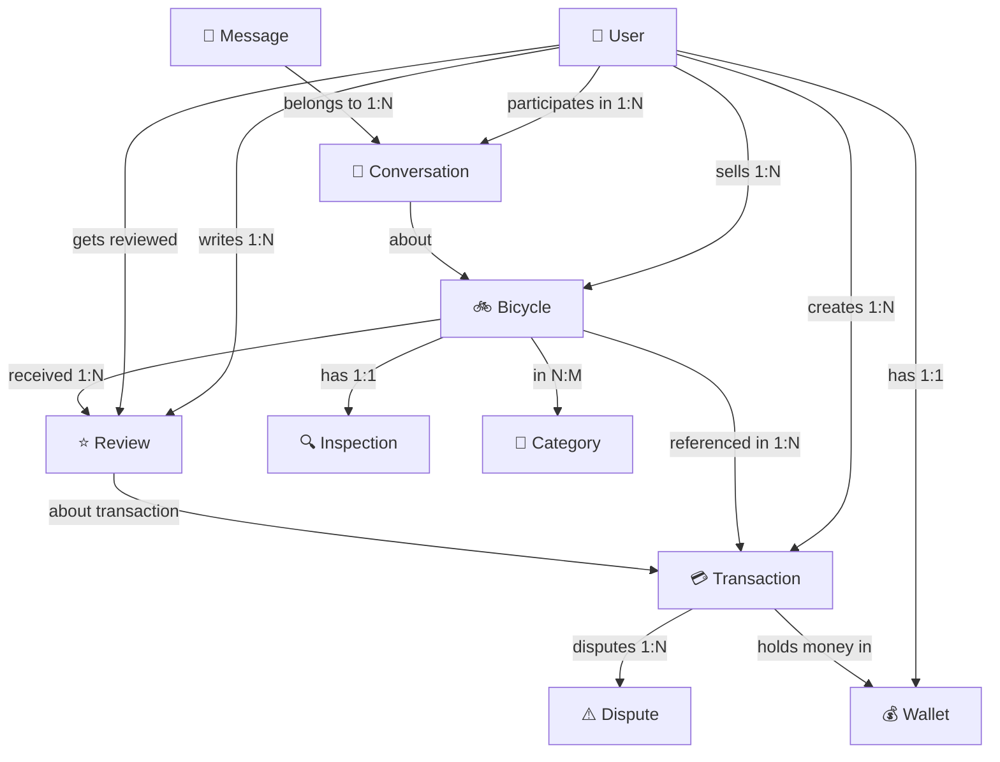

# 🚲 Old Bicycle Marketplace - Comprehensive Codebase Analysis

## 📋 Executive Summary

This is a **full-stack, multi-role P2P bicycle marketplace** built with:
- **Backend**: NestJS + MongoDB + Socket.IO for real-time features
- **Frontend**: React 19 + Vite + Tailwind CSS
- **Payment**: ZaloPay integration for online payments
- **Real-time Communication**: Socket.IO for messaging and live updates
- **Cloud Services**: Cloudinary for image management
- **Financial System**: Escrow, Wallet, and Dispute resolution

The application manages a complete transaction lifecycle with built-in protection mechanisms, quality control through inspections, and community trust through reviews.

---

## 🏗️ 1. BACKEND ARCHITECTURE

### 1.1 Tech Stack

**Core Framework**: NestJS 11
- **Runtime**: Node.js
- **Database**: MongoDB + Mongoose ODM
- **Authentication**: JWT + Passport.js
- **Real-time**: Socket.IO
- **APIs**: Swagger/OpenAPI documentation
- **Scheduling**: @nestjs/schedule for cron jobs

**Key Dependencies**:
```json
{
  "core": "@nestjs/core, @nestjs/common",
  "database": "@nestjs/mongoose, mongoose",
  "auth": "@nestjs/jwt, @nestjs/passport, passport-jwt",
  "realtime": "@nestjs/websockets, @nestjs/platform-socket.io",
  "payments": "cloudinary, axios",
  "utilities": "bcrypt, class-validator, class-transformer",
  "scheduling": "@nestjs/schedule"
}
```

### 1.2 Module Architecture (15 Feature Modules)

```
src/modules/
├── auth/              # JWT authentication, login, register
├── users/             # User management, profiles
├── bicycles/          # Bicycle listings, CRUD
├── categories/        # Bicycle categories and subcategories
├── messages/          # Real-time messaging (Socket.IO gateway)
├── conversations/     # Chat conversation management
├── transactions/      # Transaction lifecycle management
├── escrow/            # Escrow service and auto-release
├── payment/           # Payment processing (ZaloPay integration)
├── wallet/            # User wallets, balance management
├── reviews/           # Seller ratings and product reviews
├── disputes/          # Dispute creation and resolution
├── inspections/       # Bicycle inspection reports
├── notifications/     # System notifications
├── cloudinary/        # Image upload and management
├── admin/             # Admin dashboard and controls
```

### 1.3 Core Application Setup

**[app.module.ts](./backend/src/app.module.ts)**
- **Config**: Global environment variables via ConfigModule
- **Database**: MongoDB connection with Mongoose
- **Rate Limiting**: Throttler with 10 requests/60s
- **Scheduling**: Cron jobs for auto-escrow release
- **Global Guards**: JWT Auth Guard, Roles Guard applied to all routes
- **Schema Registration**: All 13 entities registered with MongoDB

**Global Middleware & Guards**:
```typescript
// auth/guards/jwt-auth.guard.ts
JwtAuthGuard → Validates JWT token on protected routes

// auth/guards/roles.guard.ts
RolesGuard → Checks @Roles() decorator for authorization
```

---

## 📊 2. DATABASE STRUCTURE & ENTITIES

### 2.1 Core Entities (Schemas)

#### **User Entity** (`user.entity.ts`)
```typescript
User {
  _id: ObjectId
  email: string (unique)
  password: string (hashed)
  role: enum [buyer, seller, inspector, admin]
  status: enum [active, suspended, banned]
  firstName?: string
  lastName?: string
  avatar?: string (Cloudinary URL)
  address?: string
  city?: string
  district?: string
  
  reputation: {
    rating: 0-5 (avg from reviews)
    totalReviews: number
    totalSales: number
    totalInspections: number
  }
  
  favourites?: { itemId: ObjectId }[]  // Wishlist
  timestamps: { createdAt, updatedAt }
}
```

**Key Relationships**: 
- User → has many Bicycles (as seller)
- User → has many Transactions (as buyer/seller)
- User → has many Reviews (as reviewer/reviewee)
- User → has one Wallet

---

#### **Bicycle Entity** (`bicycle.entity.ts`)
```typescript
Bicycle {
  _id: ObjectId
  sellerId: ObjectId (ref: User) ⭐
  title: string (bắt buộc)
  price: number
  
  specifications: {
    type: enum [mountain, road, hybrid, electric, folding, bmx, cruiser]
    brand: string
    model?: string
    frameSize?: string
    frameMaterial?: enum [aluminum, carbon, steel, titanium, alloy]
    year?: number
    color?: string
    weight?: number
    gears?: number
    brakeType?: enum [disc, rim, hydraulic, mechanical]
    wheelSize?: string
    suspension?: enum [none, front, full, rear]
  }
  
  condition: {
    overall: enum [new, like-new, good, fair, poor]
    mileage?: number (km)
    components?: { name, condition, notes }[]
  }
  
  media: {
    images: string[] (Cloudinary URLs, max 10)
    mainImage: string (featured image)
    videos?: string[] (YouTube links)
  }
  
  location: {
    city: string
    district: string
    address: string
  }
  
  inspection: {
    isInspected: boolean
    inspectionType?: enum [onsite, online]
    inspectionFee?: number (200,000 VND standard)
  }
  
  status: enum [draft, pending_review, active, sold, reserved, hidden, rejected]
  
  reviewCount: number
  averageRating: number
  
  timestamps: { createdAt, updatedAt }
}
```

**Admin Moderation**: Bicycles go through pending_review before becoming active.

---

#### **Transaction Entity** (`transaction.entity.ts`)
```typescript
Transaction {
  _id: ObjectId
  bicycleId: ObjectId (ref: Bicycle)
  buyerId: ObjectId (ref: User)
  sellerId: ObjectId (ref: User)
  
  type: enum [
    full_payment,      // Standard purchase
    deposit,           // Deposit for reservation
    inspection_fee,    // Inspection cost
    commission,        // Platform fee
    penalty,           // Violation penalty
    refund,            // Refund processing
    dispute_refund     // Dispute resolution
  ]
  
  amount: number
  
  status: enum [
    pending_payment,
    payment_received,
    held_in_escrow,      // ⭐ Waiting for delivery
    awaiting_delivery,   // Awaiting buyer to confirm receipt
    delivered,
    completed,           // ✅ Final status
    refunded,
    disputed,
    cancelled,
    deposit_paid,
    buyer_confirmed
  ]
  
  escrow: {
    heldAmount: number          // Amount in escrow
    releaseDate: Date           // When to release
    autoReleaseDeadline: Date   // Auto-release if no dispute
  }
  
  payment: {
    method: enum [bank_transfer, e_wallet, credit_card, cash]
    transactionId: string  (ZaloPay or gateway ID)
    paidAt: Date
  }
  
  fees: {
    platformFee: number      // Fixed registration fee
    commissionRate: number   // % of sale price
    commissionAmount: number
    shippingFee?: number
  }
  
  shipping: {
    provider?: string
    trackingNumber?: string
    estimatedDelivery?: Date
  }
  
  /** More fields: notes, timeline, dispute flags **/
}
```

**Transaction Lifecycle**:
```
1. Create Transaction
   ↓
2. Payment Gateway (ZaloPay)
   ↓ (Payment received)
3. Held in Escrow (with auto-release deadline)
   ↓ (Buyer confirms or deadline passes)
4. Completed (funds released to seller)
   ↓
5. (Optional) Dispute → Frozen in Escrow → Admin Resolution
```

---

#### **Wallet Entity** (`wallet.entity.ts`)
```typescript
Wallet {
  _id: ObjectId
  userId: ObjectId (ref: User, unique)
  
  type: enum [
    user,        // Individual's wallet
    escrow,      // Temp holding during transactions
    platform     // Company commission wallet
  ]
  
  balance: number         // Available balance (VND)
  totalDeposited: number  // Lifetime deposits
  totalWithdrawn: number  // Lifetime withdrawals
  totalEarned: number     // (Sellers) Total from sales
  totalSpent: number      // (Buyers) Total purchases
  pendingBalance: number  // Amount in escrow (not available)
  
  status: enum [active, frozen, suspended]
  
  lastTransactionAt?: Date
  timestamps: { createdAt, updatedAt }
}

// Wallet Transactions track every movement
WalletTransaction {
  walletId: ObjectId
  type: enum [deposit, withdrawal, transfer, commission, refund, penalty]
  amount: number
  description: string
  relatedTransaction?: ObjectId  // Link to Transaction
  status: enum [pending, completed, failed]
}
```

**Flow**: 
- Buyer pays → Funds move to Escrow wallet
- Deadline passes → Funds move to Seller's wallet
- Dispute raised → Funds frozen in dispute wallet

---

#### **Message & Conversation Entities**

```typescript
Conversation {
  _id: ObjectId
  participants: ObjectId[]           // [buyerId, sellerId]
  bicycleId?: ObjectId (ref: Bicycle)  // May be about a specific listing
  
  lastMessage: {
    text?: string
    senderId: ObjectId
    timestamp: Date
  }
  
  unreadCount: Map<string, number>   // Unread per user
  status: enum [active, archived, blocked]
}

Message {
  _id: ObjectId
  conversationId: ObjectId (ref: Conversation)
  senderId: ObjectId (ref: User)
  
  content: {
    text?: string
    attachments?: {
      type: enum [image, document, link]
      url: string
      name?: string
    }[]
  }
  
  isRead: boolean
  readAt?: Date
  timestamps: { createdAt }
}
```

**Indexes**: 
- Conversation by participants → Fast 1:1 lookup
- Message by conversationId + createdAt → Chronological retrieval

---

#### **Review Entity** (`review.entity.ts`)
```typescript
Review {
  _id: ObjectId
  reviewerId: ObjectId (ref: User)        // Who wrote it
  reviewedUserId: ObjectId (ref: User)    // About whom
  transactionId?: ObjectId                // For purchase verification
  bicycleId?: ObjectId
  
  rating: number (1-5)  ⭐
  comment?: string
  
  aspects: {
    communication: 1-5    // How responsive?
    accuracy: 1-5         // Was description accurate?
    professionalism: 1-5  // Professional transaction?
  }
  
  isVerifiedPurchase: boolean  // ✅ Verified badge
  
  response?: {
    text: string
    respondedAt: Date      // Seller can reply
  }
  
  status: enum [active, hidden, flagged]
}
```

**Used For**: Updates User.reputation stats.

---

#### **Dispute Entity** (`dispute.entity.ts`)
```typescript
Dispute {
  _id: ObjectId
  transactionId: ObjectId (ref: Transaction)
  reporterId: ObjectId                    // Buyer filing dispute
  
  reason: enum [
    item_not_received,
    item_not_as_described,
    damaged_item,
    counterfeit_parts,
    seller_unresponsive,
    buyer_refusing_delivery,
    other
  ]
  
  description: string
  
  evidence: {
    photos?: string[]        // Cloudinary URLs
    videos?: string[]
    documents?: string[]
  }
  
  status: enum [
    open,
    under_review,
    awaiting_evidence,
    resolved_buyer_favor,    // Refund issued
    resolved_seller_favor,   // Dispute closed
    resolved_partial_refund, // Split decision
    return_requested,        // Return required
    awaiting_seller_confirmation,
    return_received,
    closed
  ]
  
  resolution?: {
    decision: string
    refundAmount: number
    penaltyToSeller?: number  // Fine for bad behavior
    penaltyToBuyer?: number
    notes: string
    requireReturn: boolean
    resolvedAt: Date
  }
  
  timeline: {
    action: string
    performedBy: ObjectId  // Who took action
    timestamp: Date
  }[]
}
```

---

#### **Inspection Report Entity** (`inspection-report.entity.ts`)
```typescript
InspectionReport {
  _id: ObjectId
  bicycleId: ObjectId (ref: Bicycle)
  inspectorId: ObjectId (ref: User)  // Inspector who did it
  
  type: enum [onsite, online]
  
  technicalChecks: {
    frame: { condition, issues[], notes }
    brakes: { condition, issues[], notes }
    drivetrain: { condition, issues[], notes }
    wheels: { condition, issues[], notes }
    suspension: { condition, issues[], notes }
  }
  
  // ComponentCondition: excellent, good, fair, poor, n/a
  
  verdict: enum [
    approved,                    // ✅ Pass inspection
    approved_with_conditions,    // ✅ Pass but note issues
    rejected,                    // ❌ Fails inspection
    pending
  ]
  
  notes?: string
  
  media: {
    photos?: string[]           // Inspection photos
    videos?: string[]
  }
}
```

---

#### **Additional Entities**

```typescript
Notification {
  _id: ObjectId
  userId: ObjectId
  type: string  // 'transaction', 'review', 'dispute', 'message'
  title: string
  message: string
  relatedEntity?: ObjectId  // Link to transaction/dispute/etc
  isRead: boolean
  createdAt: Date
}

Category {
  _id: ObjectId
  name: string  // e.g., "Mountain Bikes"
  slug: string
  icon?: string  // Cloudinary URL
  isActive: boolean
  displayOrder: number
}

WishList {
  _id: ObjectId
  userId: ObjectId
  bicycleId: ObjectId
  addedAt: Date
}

SystemSetting {
  key: string (unique)
  value: any
  // Used for: commission %, listing fees, etc.
}

AuditLog {
  _id: ObjectId
  action: string             // 'payment_received', 'dispute_created'
  actorId: ObjectId
  entityType: string         // 'transaction', 'user', 'dispute'
  entityId: ObjectId
  changes: object            // What changed
  timestamp: Date
}
```

### 2.2 Database Relationships



---

## 🔐 3. AUTHENTICATION & AUTHORIZATION FLOW

### 3.1 Authentication Flow

**[auth/auth.service.ts](./backend/src/modules/auth/auth.service.ts)**

```
1. REGISTRATION (registerDto)
   - Email validation (must be unique)
   - Password hashing with bcrypt (salt rounds: 10)
   - Create User record with role
   - Generate JWT token
   - Create default Wallet
   
2. LOGIN (signInDto: email, password)
   ├─ Find user by email
   ├─ Check user.status === 'active' (not suspended/banned)
   ├─ Validate password (bcrypt compare)
   └─ Generate JWT token

3. JWT TOKEN STRUCTURE
   Payload: {
     id: string           // user._id
     email: string
     role: enum          // buyer, seller, inspector, admin
   }
   
   Generated via JwtService.sign()
   Stored in localStorage (frontend)
   Sent in Authorization header: "Bearer <token>"

4. TOKEN VALIDATION (JwtAuthGuard)
   ├─ Extract token from header
   ├─ Verify signature (secret)
   ├─ Validate payload
   └─ Attach user to request.user
```

**Key Files**:
- [auth.service.ts](./backend/src/modules/auth/auth.service.ts) - Core logic
- [auth.controller.ts](./backend/src/modules/auth/auth.controller.ts) - Endpoints
- [jwt-auth.guard.ts](./backend/src/common/guards/jwt-auth.guard.ts) - Token validation
- [roles.guard.ts](./backend/src/common/guards/roles.guard.ts) - Role-based access

### 3.2 Authorization (Roles-Based)

```typescript
// Decorator usage
@Controller('admin')
@UseGuards(JwtAuthGuard, RolesGuard)
@Roles(UserRole.ADMIN)
export class AdminController {
  @Get('users')
  @Roles(UserRole.ADMIN)
  getAllUsers() { }
}

// Role checks
SELLER: Can create/edit/delete own bicycles
BUYER: Can purchase, leave reviews, file disputes
INSPECTOR: Can write inspection reports
ADMIN: Access all moderation tools, user management
```

---

## 💳 4. PAYMENT & ESCROW SYSTEM

### 4.1 Payment Processing

**[payment/payment.service.ts](./backend/src/modules/payment/payment.service.ts)**

```
PAYMENT FLOW (Buyer Purchases Bicycle):

1. Create Transaction
   ├─ Verify bicycle available
   ├─ Create transaction record (status: pending_payment)
   ├─ Calculate fees
   └─ Return transaction ID

2. Generate Payment URL (ZaloPay Integration)
   ├─ Amount = bicycle price + commission
   ├─ Call ZaloPayService.createOrder()
   ├─ Return order_url (redirect to ZaloPay)
   └─ Return app_trans_id (for tracking)

3. Payment Callback (Webhook from ZaloPay)
   ├─ Verify signature
   ├─ Check order status
   ├─ Update transaction (status: payment_received)
   └─ Move funds to Escrow wallet
   
4. Escrow Period Starts
   - Duration: Usually 5-7 days configurable
   - Auto-release if no dispute filed
   - Funds frozen in escrow wallet
```

**ZaloPay Integration**:
```typescript
// In payment.service.ts
async createZaloPayPayment(
  transactionId: string,
  userId: string,
  userEmail: string,
  amount: number
): Promise<{ order_url: string; app_trans_id: string }>
```

---

### 4.2 Escrow System

**[escrow/escrow.service.ts](./backend/src/modules/escrow/escrow.service.ts)**

```
ESCROW SYSTEM (Protects Both Buyer & Seller):

State: HELD_IN_ESCROW (Transaction Status)
Location: Wallet.pendingBalance (not in user balance)

TIMELINE:
┌─────────────────────────────────────────────────────┐
│ Payment Received                                    │
│ ↓ Funds transferred to Escrow wallet                │
│ Auto-release deadline: now + 7 days                 │
├─────────────────────────────────────────────────────┤
│ OPTION 1: Buyer Confirms Receipt (Happy Path)      │
│   └─ Transaction.status = COMPLETED                │
│   └─ Funds → Seller's wallet                       │
│   └─ Seller can withdraw monies                    │
├─────────────────────────────────────────────────────┤
│ OPTION 2: Dispute Filed                            │
│   └─ Transaction.status = DISPUTED                 │
│   └─ Funds FROZEN (cannot be touched)              │
│   └─ Dispute resolution → Admin decides            │
│   └─ Refund or Release to seller                   │
├─────────────────────────────────────────────────────┤
│ OPTION 3: Auto-release (Deadline Passed)           │
│   └─ No dispute? Funds auto-released               │
│   └─ Scheduled job runs daily                      │
│   └─ Funds → Seller's wallet                       │
└─────────────────────────────────────────────────────┘

KEY PROTECTION:
✅ Buyer: Funds held until receipt confirmed
✅ Seller: Guaranteed payment if no dispute by deadline
✅ Both: Escrow is neutral third party

@nestjs/schedule: Cron job for auto-release
Runs daily: check autoReleaseDeadline timestamps
```

---

### 4.3 Wallet System

**[wallet/wallet.service.ts](./backend/src/modules/wallet/wallet.service.ts)**

```
THREE WALLET TYPES:

1. USER WALLET (Personal)
   - Each user has exactly one
   - balance = available funds (VND)
   - pendingBalance = escrow (reserved)
   - Used for: Deposits, withdrawals, checking balance

2. ESCROW WALLET
   - Temporary during transactions
   - HeldAmount = money being held
   - Never directly accessible by users
   - Released when conditions met

3. PLATFORM WALLET
   - Company commission accumulation
   - Populated from transaction fees
   - Used for: Company revenue tracking

WALLET TRANSITIONS:
Buyer Balance        Seller Balance
    ↓ (pay)             ↓ (receives)
Escrow Wallet
    ↓ (after 7 days or buyer confirm)
         Seller's Available Balance
              ↓ (withdraw)
         Bank Account (via payment)
```

---

## 📨 5. REAL-TIME MESSAGING SYSTEM

### 5.1 Socket.IO Integration

**Architecture**:
- Backend: [@nestjs/websockets](./backend/src/modules/messages/messages.gateway.ts)
- Frontend: [socket.io-client](./frontend/src/services/socketService.js)
- Transport: WebSocket with fallback to polling

**[messages/messages.gateway.ts](./backend/src/modules/messages/messages.gateway.ts)**
```typescript
@WebSocketGateway({
  cors: { origin: process.env.FRONTEND_URL },
  namespace: '/'
})
export class MessagesGateway {
  // Emits & listens for real-time events
}
```

### 5.2 Chat Flow

```
PARTICIPANTS: Buyer ↔ Conversation ↔ Seller
CONTEXT: Often about a specific Bicycle

1. INITIATE CONVERSATION
   - Buyer interested in listings
   - System creates Conversation with both users
   - Optional link to Bicycle
   
2. SEND MESSAGE (Real-time via Socket.IO)
   Event: 'send-message'
   Data: {
     conversationId,
     text,
     attachments? []
   }
   
   Backend:
   - Validate user in conversation
   - Create Message record in DB
   - Emit 'new-message' to all participants
   
   [chatApi.jsx](./frontend/src/api/chatApi.jsx): REST API for fetch history

3. MESSAGE FEATURES
   ✅ Typing indicator: 'user-typing', 'user-stop-typing'
   ✅ Online status: 'user-online', 'user-offline'
   ✅ Read receipts: 'messages-read' marks isRead=true
   ✅ Unread count: Map<userId, count>
   ✅ Auto-scroll to latest message

4. REAL-TIME EVENTS
   - 'new-message': Someone sent message
   - 'user-typing': Someone is typing
   - 'user-stop-typing': Stopped typing
   - 'user-online': User connected
   - 'user-offline': User disconnected
   - 'messages-read': Messages marked as read
```

**Frontend Implementation**:

[ChatContext.jsx](./frontend/src/contexts/ChatContext.jsx):
```jsx
// Global state management for chat
const [conversations, setConversations]  // List of chats
const [activeConversation, setActiveConversation]  // Current chat
const [messages, setMessages]  // Messages in current chat
const [onlineUsers, setOnlineUsers]  // Online status
const [typingUsers, setTypingUsers]  // Typing indicators

// Socket.IO listeners setup when user logs in
useEffect(() => {
  socketService.connect(userId);
  socketService.on('new-message', handleNewMessage);
  socketService.on('user-online', handleUserOnline);
  // ... more listeners
}, [user])
```

---

## 🏪 6. BICYCLE LISTING FLOW

**Reference**: [BICYCLE_LISTING_FLOW.md](../frontend/BICYCLE_LISTING_FLOW.md)

### 6.1 Create Listing (Seller Workflow)

**[CreateListing.jsx](./frontend/src/pages/seller/CreateListing.jsx)** - 4-Tab Form

```
TAB 1: GENERAL INFORMATION
├─ title* (required) - Product name
├─ type* (required) - Bicycle type (mountain, road, hybrid, etc)
├─ brand* (required) - Brand name
├─ model - Model/version
├─ condition* (required) - new, like-new, good, fair, poor
└─ description* (required) - Detailed description

TAB 2: TECHNICAL SPECIFICATIONS
├─ year - Manufacturing year
├─ frameSize - Frame size
├─ frameMaterial - 5 material types
├─ wheelSize - Wheel diameter
├─ gears - Number of gears
├─ brakeType - 4 brake types
├─ suspension - 4 suspension types
├─ color - Paint color
└─ weight (kg)

TAB 3: MEDIA (IMAGES & VIDEOS)
├─ images* - Upload up to 10 images
│  ├─ Max 5MB each
│  ├─ Converted to Cloudinary URLs
│  └─ Select one as main image
├─ mainImage - Featured product image
└─ videos - Optional YouTube links

TAB 4: PRICING & LOCATION
├─ price* (required) - Selling price (VND)
├─ city - City/Province
├─ district - District/County
├─ address - Full address
├─ inspection options:
│  ├─ No inspection
│  └─ Onsite inspection (200,000 VND fee)
└─ Fee summary:
   ├─ Listing fee: 15,000 VND (free x2)
   ├─ Inspection fee: 200,000 VND (free x1)
   └─ Total: calculated

SUBMISSION OPTIONS:
A) Save as DRAFT
   - No validation
   - status: 'draft'
   - Can edit later

B) PUBLISH
   - Full validation
   - status: 'pending_review'
   - Admin approval required
   - Listing fee deducted from wallet

C) Publish + Request Inspection
   - Creates inspection request
   - Inspector assigned
   - Inspection scheduled
```

### 6.2 Listing Lifecycle

```
┌──────────────┐
│   CREATED    │ (seller creates)
│ status:draft │
└──────┬───────┘
       │ (seller publishes)
┌──────▼────────────────┐
│  PENDING REVIEW       │ (awaiting admin approval)
│ status:pending_review │
└──────┬────────────────┘
       │ (admin approves)        │ (admin rejects)
       └──────────────┬──────────┘
                      │
    ┌─────────────────┼─────────────────┐
    │                 │                 │
┌───▼──┐        ┌────▼─────┐      ┌───▼──┐
│ACTIVE│        │ REJECTED  │      │HIDDEN│ (admin hides)
└──┬───┘        └────────────┘      └──────┘
   │ (purchase)
┌──▼──────┐
│   SOLD   │ (transaction completed)
└──────────┘

SIDE ROUTES:
RESERVED: Buyer made deposit, waiting
INSPECTION: System doing quality check
```

---

## 👤 7. USER ROLES & PERMISSIONS

### 7.1 Role Matrix

```
ROLE      | PERMISSIONS
──────────┼────────────────────────────────────────────────
GUEST     | - View listings, search, filter
          | - Read reviews
          | - Cannot purchase, contact seller
          | (Must register)
────────────────────────────────────────────────────────────
BUYER     | - All guest permissions
          | + Create account
          | + Add/remove wishlist
          | + Purchase bicycles
          | + Pay for items (ZaloPay)
          | + Message sellers
          | + File disputes
          | + Rate sellers
          | + Manage orders/transactions
────────────────────────────────────────────────────────────
SELLER    | - Create/edit/delete own listings
          | - All buyer permissions
          | + Manage inventory
          | + Accept buyer inquiries
          | + View sales analytics
          | + Manage reputation
          | + Set inspection policy
          | + Respond to reviews
          | + Request inspections
────────────────────────────────────────────────────────────
INSPECTOR | - View assigned inspection requests
          | + Conduct inspections
          | + Upload reports with photos
          | + Mark items as approved/rejected
          | + View inspection history
────────────────────────────────────────────────────────────
ADMIN     | ALL PERMISSIONS + Admin functions:
          | + Approve/reject listings
          | + Moderate reviews (hide flagged)
          | + Resolve disputes
          | + View system reports
          | + Manage users (suspend/ban)
          | + Manage categories
          | + Configure system settings
          | + View audit logs
```

---

## ⚖️ 8. DISPUTE & RESOLUTION SYSTEM

**[disputes/disputes.service.ts](./backend/src/modules/disputes/disputes.service.ts)**

### 8.1 Dispute Lifecycle

```
TRIGGER: Buyer unhappy with purchase
         (after payment but before completion)

STEP 1: OPEN DISPUTE
        ├─ Buyer submits reason (7 predefined options)
        ├─ Provides description
        ├─ Uploads evidence (photos, videos, docs)
        └─ Transaction status → DISPUTED
        
STEP 2: UNDER REVIEW
        ├─ Escrow frozen
        ├─ System notifies seller
        ├─ Admin can request more evidence
        └─ Inspect original inspection report (if applicable)

STEP 3: RESOLUTION
        Admin decides:
        
        A) BUYER FAVOR
           ├─ Refund buyer full amount
           ├─ May penalize seller (reputation hit)
           └─ Mount punishment on dispute
        
        B) SELLER FAVOR
           ├─ Release funds to seller
           ├─ May penalize buyer (reputation hit)
           └─ No refund issued
        
        C) PARTIAL REFUND
           ├─ Split funds between buyer & seller
           └─ May apply penalties to both
        
        D) RETURN REQUIRED
           ├─ Buyer must return item
           ├─ Seller confirms receipt
           └─ Then refund or seller favor

STATUS FLOW:
open 
  → under_review
     → awaiting_evidence (if needed)
        → {buyer_favor, seller_favor, partial_refund}
        
Return flow:
return_requested 
  → awaiting_seller_confirmation
     → return_received
        → resolved_*

After resolution → CLOSED
```

### 8.2 Evidence & Investigation

```
Dispute Evidence Types:
│
├─ Photos: Item condition comparisons
├─ Videos: Unboxing, damage documentation
├─ Documents: Proof of delivery, conversations, etc
│
Inspector can be involved:
│
├─ Compare with inspection report
├─ Evaluate if seller misrepresented
├─ Write comparison notes
└─ Influence resolution decision
```

---

## 🔍 9. INSPECTION SYSTEM

**[inspections/inspections.service.ts](./backend/src/modules/inspections/inspections.service.ts)**

### 9.1 Inspection Types

```
TYPE: ONSITE (Default)
├─ Inspector visits seller location
├─ Physical examination
├─ Takes photos/videos
├─ Free for first inspection
├─ Fee: 200,000 VND if repeat

TYPE: ONLINE
├─ Remote inspection
├─ Seller provides angles/photos
├─ Limited to visual assessment
└─ Lower fee option

AVAILABILITY:
□ OPTIONAL: Seller chooses inspection
□ MANDATORY: Admin can require for disputed items
□ RECURRING: Can request new inspection if issue found
```

### 9.2 Inspection Report

```
InspectionReport includes:

Technical Checks (5 areas):
├─ Frame: excellent, good, fair, poor, n/a
├─ Brakes: condition + issues list + notes
├─ Drivetrain: gears, chain, derailleurs
├─ Wheels: rims, spokes, hubs
└─ Suspension: function, leaks, damage

Evidence:
├─ Photos: Each component examined
└─ Videos: Key functionality demonstration

Verdict Options:
├─ ✅ APPROVED: Matches description perfectly
├─ ✅ APPROVED WITH CONDITIONS: Some minor issues noted
├─ ❌ REJECTED: Major issues, misrepresentation
└─ ⏳ PENDING: Awaiting final assessment

The verdict affects:
- Bicycle status
- Seller reputation
- Dispute resolution (if applicable)
```

---

## ⭐ 10. REVIEW & REPUTATION SYSTEM

**[reviews/reviews.service.ts](./backend/src/modules/reviews/reviews.service.ts)**

### 10.1 Review Types

```
TRANSACTION REVIEW (After purchase)
├─ Reviewer: Buyer
├─ Reviewed: Seller
├─ Verified Purchase: ✅ Auto-marked
├─ Associated with: Transaction + Bicycle
└─ Visibility: Public on seller profile

BUYER PROFILE REVIEW
├─ Reviewer: Seller
├─ Reviewed: Buyer
└─ Reflects buyer reliability (on-time payment, etc)

COMPONENT RATINGS:
├─ Communication ⭐ (Responsiveness)
├─ Accuracy ⭐ (Item matched description)
└─ Professionalism ⭐ (How professional the transaction was)
```

### 10.2 Reputation System

```
User.reputation object:

rating: number (0.0 - 5.0)
  = Average of all review ratings
  
totalReviews: count
  = All reviews received
  
totalSales: count
  = Completed transactions as seller
  
totalInspections: count
  = Inspections completed by inspector

SELLER REPUTATION BADGE:
≥ 4.5 stars, 10+ reviews → "Trusted Seller" ⭐
3.0-4.5 → "Good" status
< 3.0 → "Needs Improvement" (may have listings rejected)

USES:
- Displayed on seller profile
- Affects ranking in search results
- Influences buyer trust
- May gate access to certain features
- Seller suspension if too low
```

### 10.3 Review Response

```
Seller can RESPOND to reviews:

Review → 'This item arrived damaged'
Seller Response ↓
'We sincerely apologize. Please contact us for replacement.'

Response appears below review
Shows seller is responsive and professional
Can improve other buyers' perception
Timestamps show when response added
```

---

## 👨‍💼 11. ADMIN & MODERATION SYSTEM

**[admin/](./backend/src/modules/admin/)**

### 11.1 Admin Dashboard

**Areas**: 
- Listing Moderation
- Dispute Resolution
- Category Management
- Transaction Oversight
- System Reports
- Settings Management
- User Management
- Inspector Management

### 11.2 Moderation Tasks

```
LISTING MODERATION:
├─ pending_review items waiting approval
├─ Check title, description, images (no inappropriate content)
├─ Verify bicycle specifications
├─ Approve → status = active (can be sold)
└─ Reject → status = rejected + notify seller

DISPUTE RESOLUTION:
├─ Review evidence from both parties
├─ Check inspection reports
├─ Decide on refund amount
└─ Apply penalties if needed

USER MANAGEMENT:
├─ View all users by role
├─ Suspend account (seller behaving badly)
├─ Ban account (breaking terms)
├─ Reset reputation if resolved
└─ View detailed user activity

CATEGORY MANAGEMENT:
├─ Create bicycle categories
├─ Update category icons (Cloudinary)
├─ Set display order
└─ Activate/deactivate categories

SYSTEM SETTINGS:
├─ Commission percentage (% of transaction)
├─ Listing fee (flat rate)
├─ Inspection fee
├─ Escrow auto-release days
├─ Throttle limits
└─ Feature flags

AUDIT LOGS:
└─ All admin actions tracked for accountability
```

---

## 🎨 FRONTEND ARCHITECTURE

---

## 🏗️ 12. FRONTEND STRUCTURE

### 12.1 Tech Stack

**Core**:
- React 19
- Vite (Build & Dev server)
- Tailwind CSS (Styling)
- React Router 6 (Navigation)

**Libraries**:
```json
{
  "networking": "axios, socket.io-client",
  "routing": "react-router-dom",
  "ui/notifications": "react-toastify",
  "date": "date-fns",
  "state-mgmt": "React Context API"
}
```

### 12.2 Directory Structure

```
frontend/
├── src/
│   ├── api/              # API endpoint services
│   │   ├── authApi.jsx
│   │   ├── chatApi.jsx
│   │   ├── userApi.jsx
│   │   ├── paymentApi.jsx
│   │   └── ... (12 services)
│   │
│   ├── contexts/         # Global state (Context API)
│   │   ├── AuthContext.jsx      # Current user, login/logout
│   │   ├── ChatContext.jsx      # Messaging state
│   │   └── CompareContext.jsx   # Products comparison tool
│   │
│   ├── pages/            # Full page components by role
│   │   ├── guest/
│   │   │   ├── LandingPage.jsx
│   │   │   └── Blog.jsx
│   │   ├── auth/
│   │   │   ├── Register.jsx
│   │   │   └── Login.jsx
│   │   ├── buyer/
│   │   │   ├── BuyerDashboard.jsx
│   │   │   ├── Marketplace.jsx
│   │   │   ├── ProductDetail.jsx
│   │   │   ├── ChatPage.jsx
│   │   │   ├── Wallet.jsx
│   │   │   ├── TransactionDetail.jsx
│   │   │   └── ...
│   │   ├── seller/
│   │   │   ├── SellerDashboard.jsx
│   │   │   ├── CreateListing.jsx
│   │   │   ├── EditListing.jsx
│   │   │   ├── ManageListings.jsx
│   │   │   └── InspectionRequests.jsx
│   │   ├── inspector/
│   │   │   └── InspectorDashboard.jsx
│   │   ├── admin/
│   │   │   ├── AdminDashboard.jsx
│   │   │   ├── ListingModeration.jsx
│   │   │   ├── DisputeResolution.jsx
│   │   │   └── ...
│   │   └── payment/
│   │       └── ZaloPayReturn.jsx
│   │
│   ├── components/       # Reusable UI components
│   │   ├── chat/
│   │   │   ├── ConversationList.jsx
│   │   │   └── ChatBox.jsx
│   │   ├── common/       # Shared components
│   │   └── ui/          # UI primitives
│   │
│   ├── layouts/          # Page layout wrappers
│   │   ├── BuyerLayout.jsx
│   │   └── DashboardLayout.jsx
│   │
│   ├── routes/
│   │   ├── appRoutes.jsx      # All routes definition
│   │   ├── PrivateRoute.jsx   # Protected route wrapper
│   │   └── routeConfig.jsx
│   │
│   ├── services/
│   │   └── socketService.js   # Socket.IO connection manager
│   │
│   ├── configs/
│   │   ├── env.js             # Environment variables
│   │   └── theme.js          # Tailwind theme customization
│   │
│   ├── assets/          # Static assets
│   │   └── images/
│   │
│   ├── App.jsx          # Root component with routing
│   ├── main.jsx         # React entry point
│   └── index.css        # Global styles
│
├── public/               # Static files
├── vite.config.js       # Vite configuration
├── tailwind.config.js   # Tailwind customization
├── postcss.config.js    # PostCSS plugins
├── eslint.config.js     # Linting rules
├── package.json
├── index.html
└── README.md
```

### 12.3 Routing Architecture

**[routes/appRoutes.jsx](./frontend/src/routes/appRoutes.jsx)**

```jsx
// Multi-role routing with permission checking

Routes:
├─ PUBLIC ROUTES
│  ├─ / (Landing Page)
│  ├─ /blog
│  ├─ /login
│  └─ /register
│
├─ BUYER ROUTES (Private, role: buyer)
│  ├─ /marketplace (Browse listings)
│  ├─ /product/:id (Product detail + reviews)
│  ├─ /compare (Side-by-side comparison)
│  ├─ /favorites (Saved items)
│  ├─ /orders (Transaction history)
│  ├─ /wallet (Account balance)
│  ├─ /chat (Messaging with sellers)
│  ├─ /profile (User profile edit)
│  └─ /payment/zalopay-return (Payment callback)
│
├─ SELLER ROUTES (Private, role: seller)
│  ├─ /seller/dashboard
│  ├─ /seller/listings (View own items)
│  ├─ /seller/listings/create
│  ├─ /seller/listings/edit/:id
│  ├─ /seller/orders (Sales overview)
│  ├─ /seller/inspections (Inspect requests)
│  ├─ /seller/reputation
│  └─ /seller/messages
│
├─ INSPECTOR ROUTES (Private)
│  └─ /inspector/dashboard (Inspection requests & reports)
│
└─ ADMIN ROUTES (Private, role: admin)
   ├─ /admin/dashboard
   ├─ /admin/listings (Moderate pending)
   ├─ /admin/disputes (Review disputes)
   ├─ /admin/categories
   ├─ /admin/transactions
   ├─ /admin/reports
   ├─ /admin/settings
   ├─ /admin/users
   └─ /admin/inspectors
```

**[PrivateRoute.jsx](./frontend/src/routes/PrivateRoute.jsx)**
```jsx
// Route guard wrapper
<PrivateRoute>
  <Component />
</PrivateRoute>

// Checks:
- Is user authenticated?
- Does user role match required role?
- If not: redirect to /login or /forbidden
```

---

## 🎯 13. KEY USER FLOWS

### 13.1 Buying Flow (Buyer Perspective)

```
PHASE 1: DISCOVERY
Step 1: Browse Marketplace
        ├─ Filter by type, location, price range
        ├─ Sort by newest, price, rating
        └─ View listing with photos, specs, seller rating

Step 2: View Product Detail
        ├─ Full specifications
        ├─ Multiple high-res images
        ├─ Seller reviews
        ├─ Inspection report (if inspected)
        └─ Price breakdown (price + fees)

Step 3: Contact Seller (Optional)
        ├─ Start chat conversation (Socket.IO)
        ├─ Ask questions about condition
        └─ Negotiate (outside system)

───────────────────────────────────────

PHASE 2: PURCHASE
Step 4: Initiate Purchase
        ├─ Click "Buy Now"
        ├─ System creates Transaction (pending_payment)
        └─ Redirects to checkout

Step 5: Payment Gateway
        ├─ Choose payment method (ZaloPay)
        ├─ Enter card/bank details (handled by ZaloPay)
        ├─ Authorize amount (price + platform fee)
        └─ Return to app (callback)
        
        OR
        
        ├─ Use wallet balance (if prepaid)
        └─ Deduct from wallet

Step 6: Payment Processing
        ├─ ZaloPay webhook confirms payment
        ├─ Transaction status: payment_received
        ├─ Money moves to Escrow wallet
        ├─ Seller notified: "New order"
        └─ Bicycle status: RESERVED (can't sell to others)

───────────────────────────────────────

PHASE 3: ESCROW PERIOD (7 days default)
Step 7: Awaiting Delivery
        ├─ Seller ships item
        ├─ Buyer receives tracking number
        ├─ Expected delivery: ~3-5 days
        └─ Money held in escrow (not seller's yet)

Step 8: Delivery & Inspection
        ├─ Bicycle arrives
        ├─ Buyer inspects condition
        ├─ Compare with photos/description
        └─ Either: "Looks good" OR "Report issue"

───────────────────────────────────────

PHASE 4: COMPLETION
Step 9: Confirm Receipt
        (Happy path)
        ├─ Buyer clicks "Confirm Receipt"
        ├─ Transaction status: COMPLETED
        ├─ Escrow released → Seller receives payment
        └─ Seller can withdraw to bank

        (Unhappy path)
        ├─ Buyer files DISPUTE
        ├─ Uploads evidence (photos, videos)
        ├─ Admin reviews case
        ├─ Admin decides: refund or deny
        └─ Funds released accordingly

Step 10: Leave Review
         ├─ Rate seller 1-5 stars
         ├─ Comment on transaction
         ├─ Rate aspects: communication, accuracy, professionalism
         └─ Review appears on seller profile

OUTCOME:
✅ Buyer has bicycle
✅ Seller has money in wallet
✅ Both can rate each other
✅ Reputation updated
```

### 13.2 Selling Flow (Seller Perspective)

```
PHASE 1: LISTING CREATION
Step 1: Create New Listing
        ├─ Navigate to "Create Listing"
        ├─ Fill 4-tab form (see section 6.1)
        └─ Upload photos/videos

Step 2: Add Specifications
        ├─ Bicycle type (mountain, road, etc)
        ├─ Brand, model, year
        ├─ Condition (new, like-new, good, fair, poor)
        ├─ Components: frame, brakes, drivetrain, etc
        └─ Physical specs: weight, color, frame size

Step 3: Upload Media
        ├─ Upload up to 10 product photos
        ├─ Photos auto-upload to Cloudinary
        ├─ Select one as "main image"
        ├─ Optional: Add YouTube video links
        └─ Images serve as primary marketing

Step 4: Set Price & Location
        ├─ Enter asking price (VND)
        ├─ Select city/district/address
        └─ Fees calculated:
           ├─ Listing fee: 15,000 VND (free x2)
           ├─ Inspection fee: 200,000 VND (optional, free x1)
           └─ Total deducted from wallet

Step 5: Optional: Request Inspection
        ├─ Select "Request Inspection"
        ├─ Choose onsite type
        ├─ Inspector assigned
        ├─ Inspection scheduled
        └─ Professional report created

Step 6: Publish Listing
        ├─ Submit for review
        ├─ Status: pending_review
        ├─ Listing fees deducted immediately
        └─ Wait for admin approval

        (Admin Reviews)
        ├─ Check image quality
        ├─ Verify specs accuracy
        ├─ No inappropriate content
        ├─ Approve → status: ACTIVE (can now be sold)
        └─ Reject → status: REJECTED (must fix)

───────────────────────────────────────

PHASE 2: WAITING FOR BUYER
Step 7: Monitor Listing
        ├─ View listing page
        ├─ Track views/interests (if analytics available)
        ├─ Respond to buyer inquiries via chat
        └─ Can edit/update listing details

Step 8: Edit or Hide
        ├─ Listing active but want to hide temp
        ├─ Click "Hide" → status: HIDDEN (doesn't appear in search)
        ├─ Can "Unhide" later
        ├─ Or delete entirely

───────────────────────────────────────

PHASE 3: BUYER PURCHASES
Step 9: Receive Notification
        ├─ Notification: "Someone bought your listing!"
        ├─ Order details with buyer info
        ├─ Payment already received
        ├─ You have 3-5 days to ship
        └─ Money in Escrow (not yet yours)

Step 10: Ship Item
         ├─ Pack bicycle securely
         ├─ Ship via courier (e.g., GHN, Grab)
         ├─ Record tracking number in system
         ├─ Update order status: "Shipped"
         └─ Buyer receives tracking notification

         (7-day escrow period starts)
         ├─ Buyer receives package
         ├─ Buyer inspects item
         ├─ Buyer confirms delivery
         └─ Money released from escrow

───────────────────────────────────────

PHASE 4: PAYMENT & REVIEW
Step 11: Receive Payment
         ├─ Transaction: COMPLETED
         ├─ Money moved to your wallet
         ├─ You can see balance increased
         ├─ Withdraw to bank account anytime
         └─ Platform commission deducted (usually ~10%)

         (If dispute filed)
         ├─ Money held in dispute resolution
         ├─ Admin investigates
         ├─ You can provide evidence
         ├─ Admin decides: your favor or buyer refund
         └─ Funds released based on decision

Step 12: Receive Review
         ├─ Buyer (usually) leaves review
         ├─ Rating 1-5 stars
         ├─ Comment on transaction
         ├─ You can respond publicly
         └─ Review affects your reputation score

Step 13: Manage Reputation
         ├─ View all reviews on your profile
         ├─ Respond professionally to criticism
         ├─ Maintain high rating (>4.5 stars)
         └─ Gets "Trusted Seller" badge at 4.5+ stars

OUTCOME:
✅ Bicycle sold
✅ Money in wallet (after fees)
✅ Reputation increased
✅ Can withdraw funds whenever
✅ Cycle repeats with next listing
```

### 13.3 Admin Dispute Resolution

```
TRIGGER: Buyer files dispute
         (e.g., "Item not as described")

WORKFLOW:

Step 1: View Dispute Queue
        ├─ Admin Dashboard → Disputes
        ├─ See pending/open disputes
        ├─ Filter by status, date, amount
        └─ Click to investigate

Step 2: Review Evidence
        ├─ See buyer's photos/videos
        ├─ Read buyer's description of issue
        ├─ Review original inspection report (if exists)
        ├─ Compare to listing description
        └─ Check item condition vs sold photos

Step 3: Contact Parties
        ├─ Request additional evidence from buyer
        ├─ Ask seller for explanation
        ├─ Document timeline
        └─ May ask inspector to evaluate

Step 4: Make Decision
        
        Option A: BUYER FAVOR (Issue is valid)
        ├─ Refund 100% to buyer
        ├─ Money released from escrow to buyer
        ├─ Seller marked with violation
        ├─ May penalize seller points
        └─ Review marked as "dispute resolved"
        
        Option B: SELLER FAVOR (Item as described)
        ├─ Release escrow to seller
        ├─ Dismiss dispute
        ├─ Buyer reputation unchanged
        └─ Close case
        
        Option C: PARTIAL REFUND (Both at fault)
        ├─ Split amount (e.g., 50/50)
        ├─ Buyer receives: 50% + shipping
        ├─ Seller receives: 50% (minus penalty)
        └─ Both get flags
        
        Option D: RETURN REQUIRED (Item defective)
        ├─ Buyer must return item
        ├─ Verify return received
        ├─ After verification: full refund
        └─ Seller loses item + money + reputation hit

Step 5: Log Action
        ├─ Create AuditLog record
        ├─ Document decision rationale
        ├─ Timestamp for accountability
        └─ Both parties notified

Step 6: Close Dispute
        ├─ Mark status: CLOSED
        ├─ Notify both parties
        ├─ Update transaction status
        ├─ Wallets updated (funds moved)
        └─ Both can now leave reviews

FRAUD DETECTION:
├─ Pattern: Seller always has disputes 🚩
├─ Action: Suspend/ban seller account
├─ Pattern: Buyer always files disputes 🚩
├─ Action: Restrict buyer, require deposits
└─ Pattern: Inspector biased toward one party ⚠️
   └─ Action: Reassign future cases to others
```

---

## 🔄 14. KEY INTEGRATION POINTS

### 14.1 Cloudinary Integration

**Purpose**: Cloud image storage + optimization

**Flows**:
```
Bicycle Listing Upload
├─ User selects images from device
├─ Frontend: Convert to base64 or FormData
├─ Upload to Cloudinary API (via backend or direct)
├─ Store URL in Bicycle.media.images[]
└─ Frontend displays from Cloudinary CDN (fast, global)

Messages with Attachments
├─ Chat file upload
├─ Store in Cloudinary
└─ Reference URL in Message.content.attachments[]

Inspection Report
├─ Inspector uploads photos
├─ Cloudinary URL stored
└─ Available in report evidence

Dispute Evidence
├─ Buyer uploads proof photos
├─ Stored in Cloudinary
└─ Admin views URLs
```

### 14.2 ZaloPay Integration

**Purpose**: Online payment processing

**Flow**:
```
1. Create Order ({amount, items, user, etc})
2. ZaloPayService calls ZaloPay API
3. Return: order_url (payment page) + app_trans_id (tracking)
4. Redirect user to ZaloPay payment page
5. User enters card/bank details (handled by ZaloPay)
6. ZaloPay sends webhook to backend
7. Verify signature (security)
8. Update transaction (payment_received)
9. Move funds to escrow
10. Confirm to user: "Payment successful"
```

### 14.3 Socket.IO Integration

**Real-time Events**:
- Message delivery (instant)
- User online/offline status
- Typing indicators
- Notification broadcasts
- Admin actions (real-time dispute alerts)

---

## 📈 15. KEY METRICS & REPORTING

### 15.1 Admin Reports

```
SYSTEM HEALTH:
├─ Active users (all roles)
├─ New listings per day
├─ Transaction volume & revenue
├─ Dispute rate (%)
└─ Average rating across sellers

USER METRICS:
├─ Top sellers (by sales)
├─ Top rated sellers (by stars)
├─ Most reviewed bicycles
├─ Highest dispute rates
└─ Inactive users (for cleanup)

FINANCIAL:
├─ Total platform revenue (commissions)
├─ Pending escrow amount
├─ Refunded amounts
├─ Dispute costs (weight impact on seller)
└─ Wallet balances (total user funds)

QUALITY CONTROL:
├─ Inspection completion rate
├─ Approved vs rejected listings
├─ False dispute claims (seller won disputes)
└─ Repeat offenders (suspended users)
```

---

## 🚀 16. DEPLOYMENT & INFRASTRUCTURE

### 16.1 Backend Deployment

```
Requirements:
├─ Node.js runtime
├─ MongoDB database (cloud: MongoDB Atlas or self-hosted)
├─ Environment variables (.env):
│  ├─ MONGODB_URI
│  ├─ JWT_SECRET
│  ├─ ZALOPAY_MERCHANT_ID
│  ├─ ZALOPAY_KEY1, KEY2
│  ├─ CLOUDINARY_API_KEY
│  └─ Frontend URL (CORS)
├─ ZaloPay API credentials
└─ Cloudinary account

Build & Run:
npm run build       # Compile TypeScript
npm run start:prod  # Start production server
```

### 16.2 Frontend Deployment

```
Build:
npm run build   # Create optimized dist/ folder

Outputs:
├─ dist/index.html        # Main app shell
├─ dist/assets/[js/css]   # Bundled code
└─ dist/assets/[images]   # Static assets

Deploy to:
├─ Vercel (drag & drop dist/)
├─ Netlify (git push integration)
├─ Cloud Storage (S3, GCS, Azure Blob)
├─ Traditional servers (NGINX, Apache)
└─ Docker container

Environment Variables:
VITE_API_URL=https://api.marketplace.com
VITE_SOCKET_URL=https://api.marketplace.com
```

---

## 🔐 17. SECURITY CONSIDERATIONS

### 17.1 Authentication & Authorization

```
✅ JWT-based authentication
   - Signed tokens expire (configurable, e.g., 24h)
   - Stored in localStorage (frontend)
   - Sent in Authorization header
   - Validated on every request

✅ Password Security
   - Hashed with bcrypt (salt: 10 rounds)
   - Never stored in plain text
   - Never transmitted

✅ Role-Based Access Control (RBAC)
   - @Roles(UserRole.ADMIN) decorator
   - Guards check user.role before allowed
   - Prevents privilege escalation

⚠️ CSRF Protection (if needed)
   - Not seeing explicit CSRF tokens
   - Recommend adding if sessions are used

⚠️ Rate Limiting
   - Throttler configured: 10 requests/60s
   - Apply stricter limits to auth endpoints
```

### 17.2 Data Protection

```
✅ Escrow System
   - Money never directly accessible during disputes
   - Frozen until admin decision

✅ Audit Logs
   - All admin actions logged
   - Cannot delete/modify audit records
   - Timestamp for accountability

✅ Dispute Evidence
   - Photos/videos stored on Cloudinary (third-party)
   - Admin can review
   - Download proof if needed

⚠️ Message Privacy
   - Messages stored in MongoDB (ensure encryption at rest)
   - Recommend TLS/HTTPS only
   - Consider end-to-end encryption for chat

⚠️ PCI Compliance (for payment)
   - Do NOT store credit card numbers
   - ZaloPay handles card processing
   - Only store transaction IDs
```

### 17.3 Input Validation

```typescript
// DTOs with class-validator
RegisterDto {
  email: string (@IsEmail())
  password: string (@MinLength(8))
  role: enum (@IsEnum())
}

CreateTransactionDto {
  bicycleId: string (@IsMongoId())
  amount: number (@IsNumber(), @Min(0))
}

// Prevents:
├─ Invalid emails
├─ Weak passwords
├─ SQL injection (MongoDB + Mongoose)
├─ Negative amounts
└─ Type errors
```

### 17.4 Error Handling

```
✅ Never expose internal details in errors
   - Instead of "MongoDB connection failed"
   - Return: "Server error. Please try again."

✅ Specific error codes for frontend
   - 400: Bad request (validation)
   - 401: Unauthorized (invalid credentials)
   - 403: Forbidden (no permission)
   - 404: Not found (resource doesn't exist)
   - 409: Conflict (email already registered)
   - 429: Too many requests (rate limit)
```

---

## 📝 18. FINAL SUMMARY TABLE

| Aspect | Technology | Purpose |
|--------|------|---------|
| **Backend** | NestJS 11 | TypeScript framework for APIs |
| **Database** | MongoDB | Document storage (flexible schema) |
| **Real-time** | Socket.IO | WebSocket messaging (low latency) |
| **Auth** | JWT + Passport | Stateless authentication |
| **Payment** | ZaloPay | Payment gateway integration |
| **Images** | Cloudinary | Cloud image hosting |
| **Frontend Framework** | React 19 | UI components & state management |
| **Styling** | Tailwind CSS | Utility-first CSS framework |
| **Build Tool** | Vite | Fast dev server & bundler |
| **Routing** | React Router 6 | Client-side navigation |
| **State** | Context API | Global state (Auth, Chat, Compare) |
| **Task Scheduling** | @nestjs/schedule | Cron jobs (escrow auto-release) |
| **Validation** | Class-validator | Input validation & DTOs |
| **Rate Limiting** | @nestjs/throttler | API call rate limiting |

---

## 🎯 KEY TAKEAWAYS

### For Developers:
1. **Modular Design**: Each feature is a separate NestJS module (clean separation of concerns)
2. **Multi-role System**: Same platform, different UIs per role (buyer, seller, inspector, admin)
3. **Real-time First**: Socket.IO for instant messaging and live notifications
4. **Payment Safety**: Escrow system protects both sides until satisfied
5. **Quality Control**: Inspection reports + dispute resolution + reviews maintain marketplace health
6. **Scalability**: MongoDB for flexible schema; JWT for stateless auth; separate Cloudinary for media

### For Users:
1. **Buyers**: Browse → Purchase with protection → Confirm delivery → Leave review
2. **Sellers**: List bicycle → Wait for buyer → Ship → Get paid (after escrow period) → Earn reputation
3. **Admins**: Approve listings → Moderate disputes → Manage users → View reports
4. **Inspectors**: Inspect bicycles → Write reports → Help with dispute resolution

---

**Generated**: March 18, 2026
**Version**: 1.0
**Project**: Old Bicycle Marketplace (P2P E-commerce Platform)
